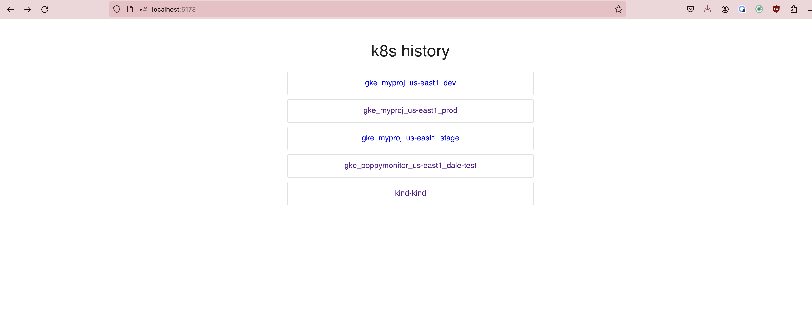

# khist

khist is a project that wraps the kubectl command and captures its output. It stores the timestamp, command, output, and output size in a SQLite database. This tool is especially useful for debugging and auditing purposes in a Kubernetes environment.

You can interact with the history in three ways:

1. Via the built-in web interface which provides a user-friendly way to view the history.




2. Using getData.sh with `fzf` for a fuzzy search through the history.


3. Directly via the SQLite database with your own code


## Getting Started

- clone this repo
- edit your .zshrc , .bashrc or equivalent for your shell and add an alist to the khist.sh script or to the go/bin/khist binary

ex:
```shell
cp go/bin/khist /usr/local/bin/
alias k=khist
# or
# alias k=/Users/you/kubecapture/khist.sh

alias kd='k get deploy'
alias kp='k get pods'

# or without an alias:
go/bin/khist get pods -A

```
- connect to your clusters and use kubectl as you normally would. Your commands and their output are stored in db files in your home directory in a `.khist` directory.

## start the backend
- cd node
- npm install
- npm run dev

## start the ui
- cd ui
- npm install
- npm run dev

- open http://localhost:5173

### Prerequisites

npm and nodejs if you want to run the web interface

## Why

While the `history` command in a shell provides a list of commands that have been entered, it doesn't provide any of the output from those commands. This can make it difficult to recall exactly what was returned from a specific command, especially when debugging or auditing. khist addresses this issue by not only capturing the commands entered but also their output.

khist also maintains a separate history for each k8s context. This means that you can have a distinct record of commands for each cluster you interact with. This feature enhances the tool's utility in multi-cluster environments, allowing for precise tracking and auditing of actions on a per-cluster basis.

